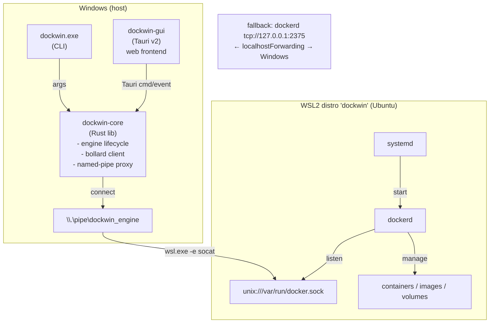

# dockwin

**A lightweight, un-bloated Docker Desktop alternative for Windows 11.**

dockwin runs stock `dockerd` inside a single **dedicated** minimal WSL2 distro
and gives you a small, native Windows GUI (Tauri v2) plus a scriptable CLI — and
nothing else. No persistent Windows service. No VPN proxy. No telemetry. No
auto-updater. Just Docker.

> Status: early development. See **[What works / What's stubbed](#what-works--whats-stubbed)**.

Licensed under **Apache-2.0 OR MIT**.

---

## Why dockwin exists

### The licensing problem

Docker Engine itself (Moby) is **Apache-2.0** — free, open, and unencumbered.
The friction is **Docker Desktop**, whose subscription terms require a **paid
license for larger organizations** (commercial use above the free-tier
size/revenue threshold). For many teams that means either paying per-seat for
what is essentially a GUI + a WSL2 plumbing layer around an engine that is
already free software, or banning Docker Desktop and losing a good developer
experience.

dockwin's thesis: **the engine is already free — so the wrapper should be too.**

### The bloat problem

Docker Desktop ships an always-on background backend (`com.docker.backend`),
a vpnkit-style network proxy, an auto-updater, and telemetry. dockwin
deliberately omits all of that. The entire product is one small Rust workspace.

### Our stack is permissively licensed, top to bottom

| Piece | License |
| --- | --- |
| Docker Engine / `dockerd` (Moby) | Apache-2.0 |
| Rust + Cargo crates (bollard, tokio, …) | MIT / Apache-2.0 |
| Tauri v2 | MIT / Apache-2.0 |
| Ubuntu WSL rootfs (base userland) | various permissive / GPL components, redistributable |
| **dockwin itself** | **Apache-2.0 OR MIT** |

You can use dockwin commercially, at any org size, for free.

---

## Architecture

dockwin is a thin Windows-native Rust core with a Tauri v2 GUI shell, driving a
single dedicated WSL2 distro (`dockwin`) that runs stock `dockerd`.



### The one wiring decision

`dockerd` in the distro listens **only** on its unix socket
`/var/run/docker.sock` — no TCP, no network attack surface. `dockwin-core`
hosts a Windows named pipe `\\.\pipe\dockwin_engine`, ACL'd to the current user
only. Each accepted pipe connection is relayed into the distro by spawning:

```
wsl.exe -d dockwin -e socat - UNIX-CONNECT:/var/run/docker.sock
```

and pumping stdio both ways (the proven `docker-wsl-bridge` primitive, run in
our direction). bollard connects to that pipe via `connect_with_named_pipe`,
and the **stock Windows `docker.exe` CLI** works too:

```powershell
docker context create dockwin --docker host=npipe:////./pipe/dockwin_engine
docker context use dockwin
docker ps
```

This mirrors how Docker Desktop bridges its distro (a Windows-side pipe server
relaying into the distro) — but minimal.

**Fallback wiring:** `dockerd` can also listen on `tcp://127.0.0.1:2375`
(loopback only) reachable from Windows via WSL2 localhost-forwarding, used only
when the pipe relay is unavailable. It is **unauthenticated and reachable by any
local process / other WSL distro**, so it is flagged insecure and never the
default. It never binds `0.0.0.0`.

### Engine provisioning

```
wsl --import dockwin <dir> ubuntu-base-24.04.tar --version 2
```

The base image is the **minimal Ubuntu 24.04 `ubuntu-base` rootfs** (~29 MB)
rather than the full server cloud image (~216 MB) — same glibc/apt userland, far
less to download. (The purpose-built WSL rootfs tarballs were removed upstream;
`ubuntu-base` is the small, reproducible, pinned alternative.) Because the
minimal base ships no systemd, the core **installs systemd first**, then writes
`/etc/wsl.conf` (`[boot] systemd=true`, interop disabled), and `wsl --shutdown`
so systemd comes up as PID 1. It then runs `systemctl enable docker`, switches
iptables to **legacy**, and sets `cgroupdriver=systemd` in `daemon.json`. Docker
is installed from the **pinned official apt repo** (reproducible, with
`--no-install-recommends`), not the unpinned `get.docker.com` script. A
diagnostic `hello-world` bridge test is **opt-in** (`DOCKWIN_RUN_NETTEST=1`) so
it doesn't add a network image pull to every setup. Teardown is
`wsl --unregister dockwin`.

### Components

| Component | Tech | Responsibility |
| --- | --- | --- |
| **dockwin-core** | Rust lib (bollard, tokio, named pipe) | The whole brain: WSL2 lifecycle, provisioning, bollard client, pipe proxy. |
| **dockwin** (CLI) | Rust binary (clap) | `up/down/status/provision/teardown` + passthrough ops. Thin parser. |
| **dockwin-gui** | Tauri v2 (Rust + web) | Stateless desktop view: container/image lists, logs, exec, stats. |
| **Named-pipe proxy** | Rust pipe server + socat | Serves `\\.\pipe\dockwin_engine`, relays each connection into the distro. |
| **dockwin WSL2 distro** | Ubuntu 24.04 `ubuntu-base` + systemd + docker-ce | Isolated engine host; `dockerd` on a unix socket, autostarted by systemd. |
| **Provisioner** | Rust (in core) + in-distro shell | Idempotent setup; verifies engine reachability before reporting ready. |

### Key design decisions

- **Named pipe relaying into the distro's unix socket** (dockerd has no network
  listener) → smallest attack surface, Docker-native for both bollard and
  `docker.exe`.
- **TCP 2375 loopback fallback**, explicitly marked insecure → three lines,
  directly supported, for when the relay misbehaves.
- **Reject the `\\wsl.localhost` unix-socket path** → it is a 9P network share,
  not a connectable AF_UNIX endpoint; verified non-working.
- **Minimal `ubuntu-base` rootfs + install systemd, run with `systemd=true`** →
  ~29 MB vs ~216 MB download, with real autostart robustness
  (`Restart=on-failure`, ordering, socket activation). Alpine deferred (musl +
  no systemd fights this design).
- **`[boot] command="service docker start"`** fallback for any non-systemd base.
- **One small Rust workspace, no persistent Windows service** → the anti-bloat
  thesis. All logic in `dockwin-core`, reused by CLI and GUI.
- **Pinned apt repo over `get.docker.com`** → reproducible, version-locked.
- **Default NAT networking**; the GUI surfaces published-port reachability and
  its caveats rather than forcing mirrored mode.

---

## Quickstart

> **Requirements:** Windows 11, WSL2 enabled and updated (`wsl --update`), and a
> recent WSL build (needed for `systemd=true`). Do **not** run dockwin alongside
> Docker Desktop — mirrored networking and `docker context` collisions can cause
> silent failures.

### 1. Provision the engine

No PowerShell required. Provision the dedicated `dockwin` WSL2 distro either way:

- **From the GUI:** launch the app and click **Set up engine** on the first-run
  panel. (Same logic, with a progress status and a **Remove engine** button under
  the ⚙ Settings menu.)
- **From the CLI:**

  ```powershell
  dockwin install      # provision    (also: status / start / stop / uninstall)
  dockwin uninstall    # tear down (add --backup to export a .tar first)
  ```

Both call the **same** `dockwin-core` code: import the Ubuntu rootfs into the
dedicated `dockwin` distro, install pinned `dockerd` + `socat`, write `wsl.conf` /
`daemon.json`, enable systemd autostart, force iptables-legacy, and verify
`dockerd`. The `scripts/*.ps1` remain only as a legacy fallback.

### 2. Build from source

This is a **Cargo workspace** plus a pnpm-managed Svelte/TS frontend:

```
crates/dockwin-core   # shared engine brain (provisioning + WSL lifecycle)
crates/dockwin-cli    # the `dockwin` CLI binary        (depends on core)
src-tauri             # the Tauri v2 GUI (dockwin-gui)  (depends on core)
src/                  # Svelte 5 + TypeScript + Tailwind v4 frontend
```

```powershell
# Install frontend deps (once) — this project uses pnpm
pnpm install

# Run the GUI in dev mode (hot-reloads the frontend, builds the Rust side)
pnpm tauri dev

# Production bundle
pnpm tauri build

# Build everything (core + CLI + GUI)
cargo build --workspace

# Just the CLI
cargo build -p dockwin-cli   # -> target/debug/dockwin.exe
```

> Most tasks are wrapped as [`just`](https://github.com/casey/just) recipes
> (`just dev`, `just installer`, `just release minor`, …). See
> **[docs/development.md](docs/development.md)** for the full dev & release
> workflow.

> The `dockwin-core` brain, the thin `dockwin` CLI, and the `dockwin-gui` shell
> now each live in their own crate and share one provisioning implementation —
> the engine/Docker logic is in `crates/dockwin-core` + `src-tauri/src/docker.rs`,
> the Tauri command surface in `src-tauri/src/commands.rs` (see the
> roadmap).

### 3. Point the stock Docker CLI at dockwin (optional)

```powershell
docker context create dockwin --docker host=npipe:////./pipe/dockwin_engine
docker context use dockwin
docker run --rm hello-world
```

### Networking note

Under default NAT, **wildcard-published** ports (`-p 8080:80`) are automatically
reachable at Windows `localhost:8080`. **`127.0.0.1`-bound** publishes
(`-p 127.0.0.1:8080:80`) are **not** forwarded — the GUI surfaces published
ports as clickable `localhost` links and warns about this caveat. The relay can
also need a `wsl --shutdown` after sleep/wake.

---

## What works / What's stubbed

> ✅ = implemented and compiles (`cargo build` + `pnpm build` both green).
> Runtime paths marked ✅* are code-complete but not yet verified against a
> freshly provisioned distro on CI. 🚧 = partial / has `TODO`s. 🟡 = planned.

| Area | Status |
| --- | --- |
| Cargo workspace: shared `dockwin-core` + `dockwin` CLI + `dockwin-gui`; TS + Tailwind v4 + Lucide frontend; dual licensing | ✅ Done |
| Provision dedicated WSL2 distro in native Rust (import, install pinned dockerd + socat, wsl.conf/daemon.json, systemd autostart, iptables-legacy, verify) — shared `dockwin-core`, assets embedded | ✅* Implemented |
| `dockwin.exe` CLI: `status` / `install` / `start` / `stop` / `uninstall` (replaces the .ps1 scripts) | ✅ Implemented |
| GUI first-run **Set up engine** panel + **Remove engine** (teardown, optional backup) — same `dockwin-core` code as the CLI | ✅* Implemented |
| Named-pipe relay `\\.\pipe\dockwin_engine` (per-conn `wsl.exe`+socat) hosted by the GUI | ✅ Implemented |
| bollard client over the named pipe (+ insecure TCP 2375 loopback fallback behind a flag) | ✅ Implemented |
| Engine status (running / stopped / not-provisioned) + start/stop from the GUI | ✅* Implemented |
| Container list with live status, ports, compose-project label | ✅ Implemented |
| Container actions: start / stop / restart / remove | ✅ Implemented |
| Clickable port mappings with localhost reachability warning | ✅ Implemented |
| Log tail (snapshot) | ✅ Implemented |
| Live log *streaming* over a Tauri channel | 🚧 `TODO` in `commands.rs` |
| Sidebar nav (Containers / Stacks / Images / Volumes / Networks / System / Settings) | ✅ Implemented |
| Live provisioning **progress bar + streamed log** (download bytes → decompress → apt), persisted to `%LOCALAPPDATA%\dockwin\logs\provision-*.log` | ✅ Implemented |
| Docker Compose **stacks** view: containers grouped by project + per-stack start/stop/restart | ✅ Implemented |
| Compose `up` / `down` / `build` / `pull` / `restart` / `logs` from a `.yml` (GUI file picker **or** `dockwin up`/`down` CLI) — runs inside the engine, not Docker Desktop's pipe | ✅ Implemented |
| **Container details** drawer: live CPU/mem/net/blk **stats**, `inspect` JSON, `top` processes, rename, pause/unpause | ✅ Implemented |
| **Images**: pull (with progress), remove, prune, tag, history, inspect | ✅ Implemented |
| **Volumes**: list, create, remove, prune, inspect | ✅ Implemented |
| **Networks**: list, create, remove, prune, inspect, connect/disconnect | ✅ Implemented |
| **System**: disk usage (`df`), prune (incl. all-images / volumes), engine info | ✅ Implemented |
| Bundle `dockwin.exe` as a Tauri sidecar + NSIS installer | ✅ Implemented |
| `curl.exe` no-console spawns + minimal `ubuntu-base` rootfs (`.tar.gz`, ~29 MB); systemd installed before the `systemd=true` reboot | ✅ Implemented |
| Live log *streaming* over a Tauri channel; interactive exec terminal | 🟡 Planned |
| Code signing / winget; hardening: pipe ACL to current user, relay load test, anti-bloat audit | 🟡 Planned |

Anything marked 🚧 / 🟡 may contain clearly-marked `TODO` stubs in the code.

---

## Roadmap / milestones

- **M0 — Skeleton:** one Rust workspace (core lib, CLI, bare Tauri shell); CI
  building all three; MIT/Apache-2.0 licensing in place.
- **M1 — Provisioning:** core imports the Ubuntu rootfs, writes
  `wsl.conf`/`daemon.json`, installs pinned `dockerd`, enables systemd autostart,
  sets iptables-legacy; `dockwin provision`/`teardown` verify dockerd on its unix
  socket.
- **M2 — Wiring:** named-pipe proxy relaying via `wsl.exe`+socat; bollard and
  stock `docker.exe` both run `docker version`; TCP 2375 fallback behind a flag.
- **M3 — Core read API:** engine status, container list + stats, image list
  through `dockwin-core` and the CLI.
- **M4 — GUI Tier-1:** engine start/stop, container list, start/stop/restart/
  remove, live log streaming, exec shell.
- **M5 — GUI Tier-2:** images (pull/delete/prune), per-container stats, clickable
  port mappings with reachability warnings.
- **M6 — Compose + volumes:** compose up/down with project grouping, volume
  list/prune; first-run provisioning UX polish.
- **M7 — Hardening:** load-test the pipe relay, WSL-version preflight, robust
  teardown with optional backup, anti-bloat audit (no telemetry, no background
  service, idle footprint measured).

---

## Known risks & caveats

- **Relay throughput** under high connection churn (per-connection `wsl.exe`+socat
  spawn) is unproven; long-lived log/exec streams are fine, but heavy churn may
  need a load test or the TCP fallback.
- **TCP 2375 fallback** is unauthenticated and reachable by any local process /
  other WSL distro — stays loopback-only and clearly flagged; never `0.0.0.0`.
- **`systemd=true` needs recent WSL** (~2.1.5+); on stale inbox WSL it is silently
  ignored. Provisioner runs `wsl --update` / version-checks first.
- **iptables nftables-vs-legacy** mismatch on newer Ubuntu can break container
  bridge networking even when dockerd starts; provisioning forces legacy. An
  opt-in `hello-world` bridge test (`DOCKWIN_RUN_NETTEST=1`) can verify
  connectivity on demand (off by default to keep setup fast).
- **Gzipped rootfs import** can fail with "Incorrect function." on older WSL;
  since the default `ubuntu-base` rootfs ships as `.tar.gz`, the provisioner
  always decompresses to a plain `.tar` first (xz too) as a safety net.
- **Don't run alongside Docker Desktop** — mirrored networking and context
  collisions can cause silent failures.
- **`wsl --unregister` permanently deletes** the distro's `ext4.vhdx` — teardown
  confirms and can optionally export a backup tar first.

---

## License

dockwin is dual-licensed under either of:

- Apache License, Version 2.0 ([LICENSE](LICENSE) or
  <https://www.apache.org/licenses/LICENSE-2.0>)
- MIT license

at your option. Unless you explicitly state otherwise, any contribution
intentionally submitted for inclusion in dockwin by you shall be dual-licensed as
above, without any additional terms or conditions.

See **[CONTRIBUTING.md](CONTRIBUTING.md)** to get started.
