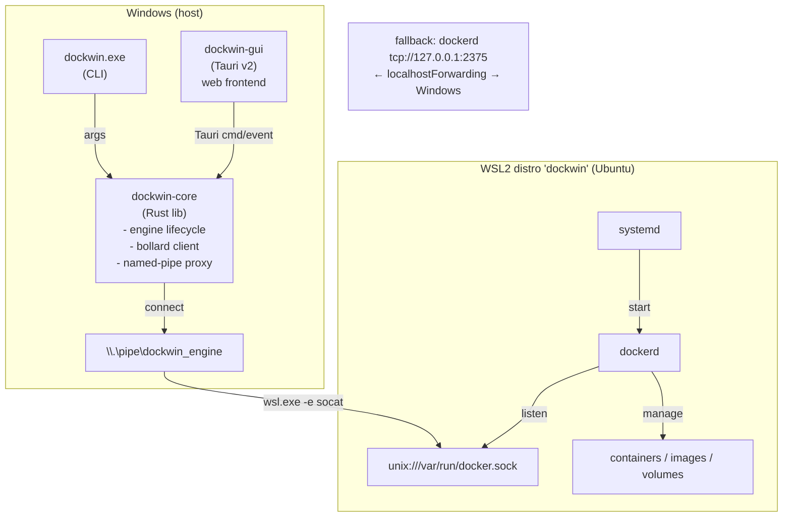

# Architecture

A thin Windows-native Rust core with a Tauri v2 GUI shell, driving one
dedicated WSL2 distro (`dockwin`) that runs stock `dockerd`.



---

## Wiring

`dockerd` in the distro listens **only** on its unix socket
`/var/run/docker.sock` — no TCP, no network attack surface. `dockwin-core`
hosts a Windows named pipe `\\.\pipe\dockwin_engine`, ACL'd to the current user
only. Each accepted pipe connection is relayed into the distro by spawning:

```
wsl.exe -d dockwin -e socat - UNIX-CONNECT:/var/run/docker.sock
```

and pumping stdio both ways (the proven `docker-wsl-bridge` primitive, run in
our direction). bollard connects to that pipe via `connect_with_named_pipe`,
and the **stock Windows `docker.exe` CLI** works too:

```powershell
docker context create dockwin --docker host=npipe:////./pipe/dockwin_engine
docker context use dockwin
docker ps
```

This mirrors how Docker Desktop bridges its distro (a Windows-side pipe server
relaying into the distro) — but minimal.

**Fallback wiring:** `dockerd` can also listen on `tcp://127.0.0.1:2375`
(loopback only) reachable from Windows via WSL2 localhost-forwarding, used only
when the pipe relay is unavailable. It is **unauthenticated and reachable by any
local process / other WSL distro**, so it is flagged insecure and never the
default. It never binds `0.0.0.0`.

## Provisioning

```
wsl --import dockwin <dir> ubuntu-base-24.04.tar --version 2
```

The base image is the **minimal Ubuntu 24.04 `ubuntu-base` rootfs** (~29 MB)
rather than the full server cloud image (~216 MB) — same glibc/apt userland, far
less to download. (The purpose-built WSL rootfs tarballs were removed upstream;
`ubuntu-base` is the small, reproducible, pinned alternative.) Because the
minimal base ships no systemd, the core **installs systemd first**, then writes
`/etc/wsl.conf` (`[boot] systemd=true`, interop disabled), and `wsl --shutdown`
so systemd comes up as PID 1. It then runs `systemctl enable docker`, switches
iptables to **legacy**, and sets `cgroupdriver=systemd` in `daemon.json`. Docker
is installed from the **pinned official apt repo** (reproducible, with
`--no-install-recommends`), not the unpinned `get.docker.com` script. A
diagnostic `hello-world` bridge test is **opt-in** (`DOCKWIN_RUN_NETTEST=1`) so
it doesn't add a network image pull to every setup. Teardown is
`wsl --unregister dockwin`.

## Components

| Component | Tech | Responsibility |
| --- | --- | --- |
| **dockwin-core** | Rust lib (bollard, tokio, named pipe) | The whole brain: WSL2 lifecycle, provisioning, bollard client, pipe proxy. |
| **dockwin** (CLI) | Rust binary (clap) | `up/down/status/provision/teardown` + passthrough ops. Thin parser. |
| **dockwin-gui** | Tauri v2 (Rust + web) | Stateless desktop view: container/image lists, logs, exec, stats. |
| **Named-pipe proxy** | Rust pipe server + socat | Serves `\\.\pipe\dockwin_engine`, relays each connection into the distro. |
| **dockwin WSL2 distro** | Ubuntu 24.04 `ubuntu-base` + systemd + docker-ce | Isolated engine host; `dockerd` on a unix socket, autostarted by systemd. |
| **Provisioner** | Rust (in core) + in-distro shell | Idempotent setup; verifies engine reachability before reporting ready. |

## Design decisions

- **Named pipe relaying into the distro's unix socket** (dockerd has no network
  listener) → smallest attack surface, Docker-native for both bollard and
  `docker.exe`.
- **TCP 2375 loopback fallback**, explicitly marked insecure → three lines,
  directly supported, for when the relay misbehaves.
- **Reject the `\\wsl.localhost` unix-socket path** → it is a 9P network share,
  not a connectable AF_UNIX endpoint; verified non-working.
- **Minimal `ubuntu-base` rootfs + install systemd, run with `systemd=true`** →
  ~29 MB vs ~216 MB download, with real autostart robustness
  (`Restart=on-failure`, ordering, socket activation). Alpine deferred (musl +
  no systemd fights this design).
- **`[boot] command="service docker start"`** fallback for any non-systemd base.
- **One small Rust workspace, no persistent Windows service** → the anti-bloat
  thesis. All logic in `dockwin-core`, reused by CLI and GUI.
- **Pinned apt repo over `get.docker.com`** → reproducible, version-locked.
- **Default NAT networking**; the GUI surfaces published-port reachability and
  its caveats rather than forcing mirrored mode.

---

See also: [development.md](development.md) for the build/release workflow,
[installer.md](installer.md) for the NSIS installer + updater, and the
[README](../README.md#known-risks--caveats) for known risks tied to this design.
